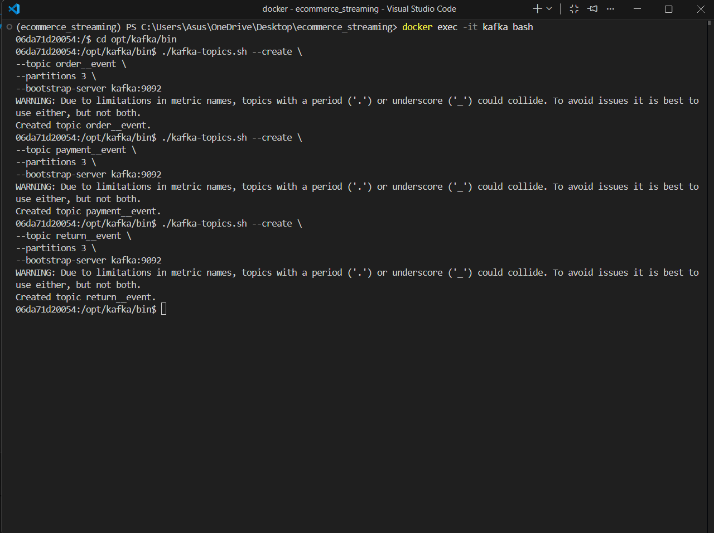
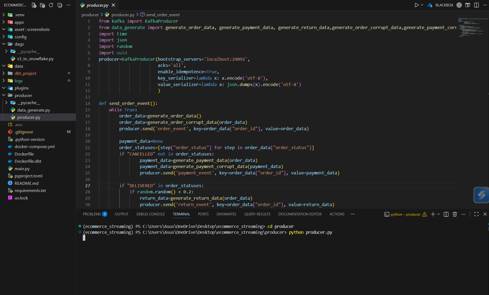
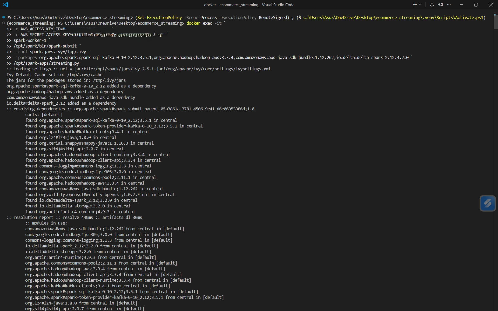
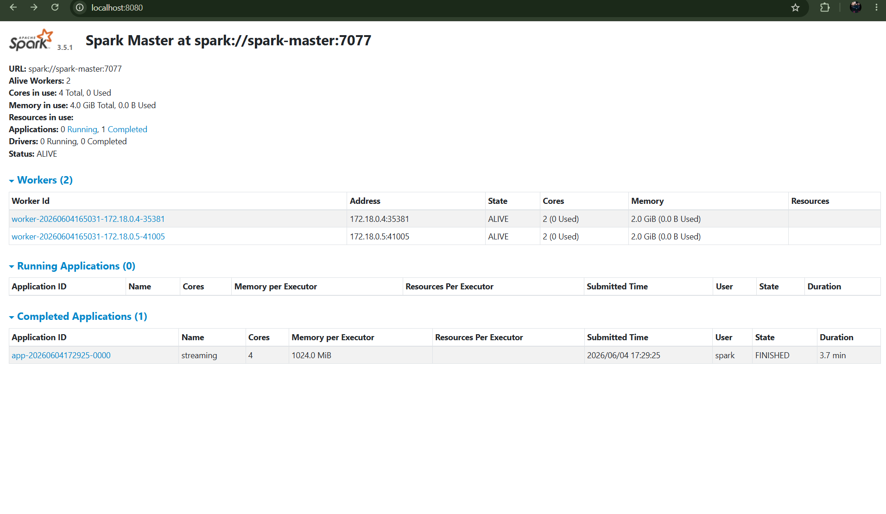
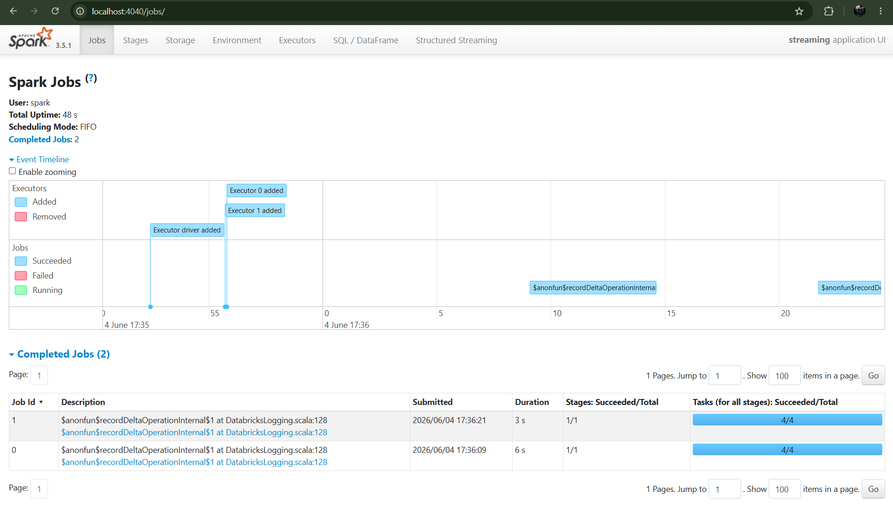
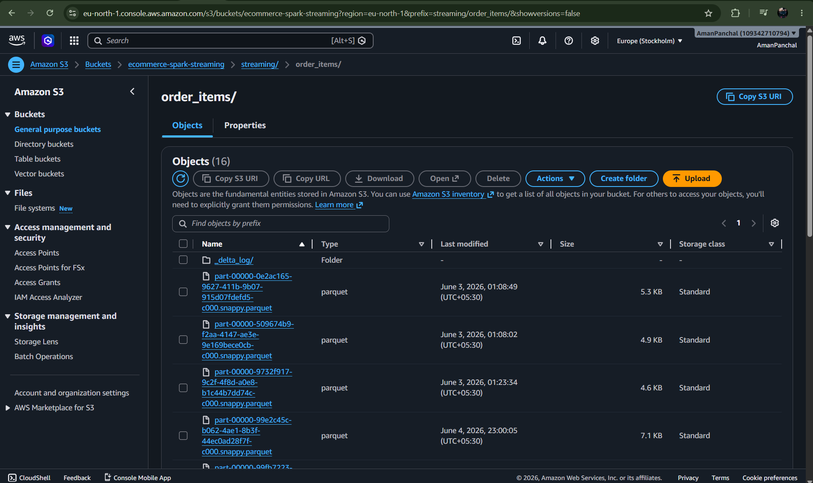
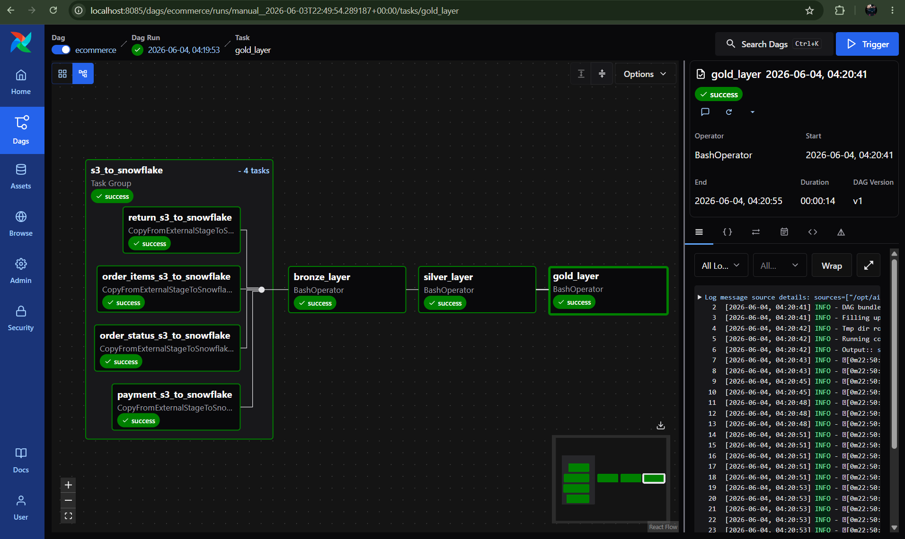
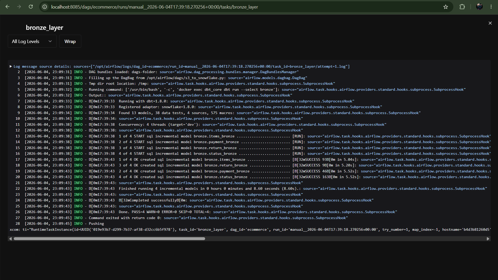
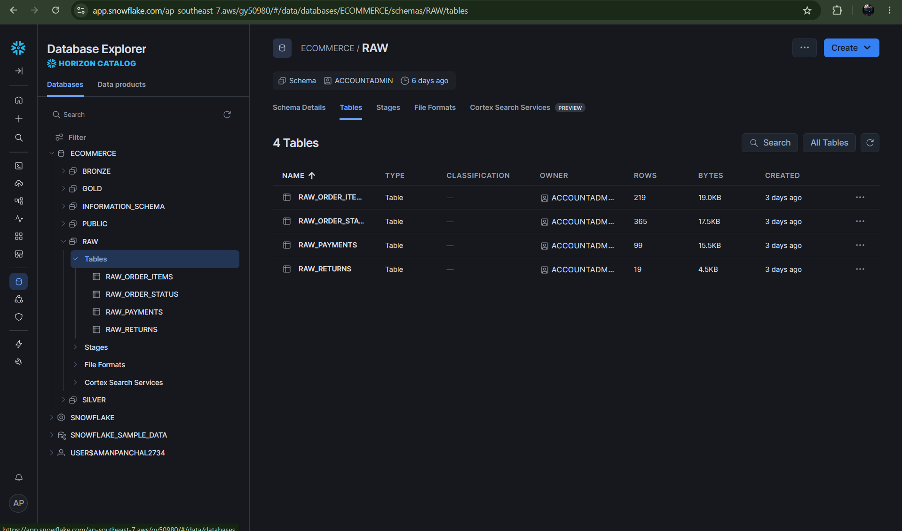
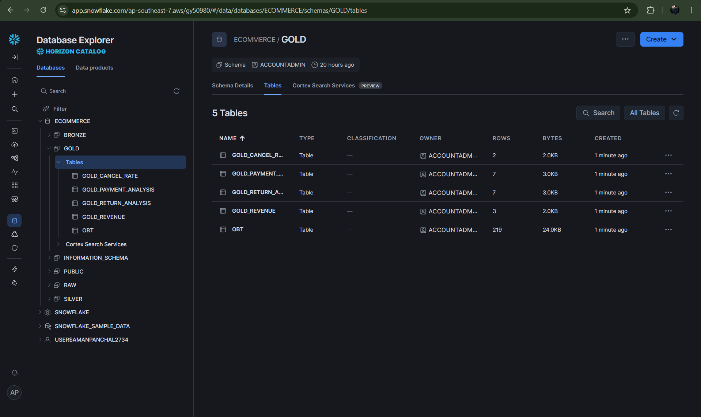

# 🛒 E-Commerce Order Intelligence Platform

A **production-grade, end-to-end real-time data engineering pipeline** that simulates e-commerce events, streams them through Kafka, processes with Spark Structured Streaming, lands data in S3, orchestrates with Airflow, loads into Snowflake, and transforms through dbt (Bronze → Silver → Gold) for dashboarding in Metabase.

---

## 📐 Architecture Overview

```
Faker (Python)
     │
     ▼
Kafka Producer (producer.py)
     │
     ├── order_event    (3 partitions)
     ├── payment_event  (3 partitions)
     └── return_event   (3 partitions)
     │
     ▼
Spark Structured Streaming (streaming.py)
     │
     ▼
Amazon S3 (Delta / Parquet)
     │  streaming/order_items/
     │  streaming/order_status/
     │  streaming/payments/
     │  streaming/returns/
     │
     ▼
Apache Airflow DAG (ecommerce)
     │
     ├── s3_to_snowflake (CopyFromExternalStage × 4)
     ├── bronze_layer    (dbt run --select bronze)
     ├── silver_layer    (dbt run --select silver)
     └── gold_layer      (dbt run --select gold)
     │
     ▼
Snowflake (RAW → BRONZE → SILVER → GOLD)
     │
     ▼
Metabase Dashboard
```

---

## 🛠️ Tech Stack

| Layer | Technology |
|---|---|
| Data Generation | Python · Faker |
| Message Broker | Apache Kafka (KRaft, no Zookeeper) |
| Stream Processing | Apache Spark 3.5.1 Structured Streaming |
| Object Storage | Amazon S3 (Delta Lake / Parquet) |
| Orchestration | Apache Airflow 3.x |
| Data Warehouse | Snowflake |
| Transformation | dbt 1.8 (Bronze → Silver → Gold) |
| Dashboard | Metabase |
| Containerisation | Docker · Docker Compose |

---

## 📁 Project Structure

```
ecommerce-order-intelligence-platform/
│
├── producer/               # Kafka producer (Faker data generation)
│   └── producer.py
│
├── apps/                   # Spark streaming application
│   └── streaming.py
│
├── dags/                   # Airflow DAGs
│   └── s3_to_snowflake.py
│
├── dbt_project/            # dbt models (Bronze / Silver / Gold)
│   ├── models/
│   │   ├── bronze/
│   │   ├── silver/
│   │   └── gold/
│   └── dbt_project.yml
│
├── config/                 # Airflow config
│   └── airflow.cfg
│
├── assets/
│   └── screenshots/
│
├── Dockerfile              # Airflow custom image
├── Dockerfile.dbt          # dbt image
├── docker-compose.yml      # Full stack orchestration
├── requirements.txt
└── README.md
```

---

## 🚀 Quick Start

### Prerequisites

- Docker & Docker Compose installed
- AWS account with an S3 bucket
- Snowflake account

### 1. Clone the repository

```bash
git clone https://github.com/AmanPanchal3110/ecommerce-order-intelligence-platform.git
cd ecommerce-order-intelligence-platform
```

### 2. Configure environment variables

Create a `.env` file at the project root:

```env
# AWS
AWS_ACCESS_KEY_ID=your_access_key
AWS_SECRET_ACCESS_KEY=your_secret_key
AWS_REGION=us-east-1
S3_BUCKET=your-bucket-name

# Airflow
AIRFLOW_UID=50000
_AIRFLOW_WWW_USER_USERNAME=airflow
_AIRFLOW_WWW_USER_PASSWORD=airflow
```

### 3. Start all services

```bash
docker compose up -d
```

This brings up: Kafka, Kafka UI, Spark Master, Spark Worker 1 & 2, Airflow (scheduler + API server + dag-processor), PostgreSQL (Airflow metadata), dbt, and Metabase.

| Service | URL |
|---|---|
| Kafka UI | http://localhost:9090 |
| Spark Master UI | http://localhost:8080 |
| Spark Worker 1 UI | http://localhost:8081 |
| Airflow | http://localhost:8085 |
| Metabase | http://localhost:3000 |

---

## 📨 Step 1 — Create Kafka Topics

Exec into the Kafka container and run the topic creation commands:

```bash
docker exec -it kafka bash
cd opt/kafka/bin

./kafka-topics.sh --create \
  --topic order_event \
  --partitions 3 \
  --bootstrap-server kafka:9092

./kafka-topics.sh --create \
  --topic payment_event \
  --partitions 3 \
  --bootstrap-server kafka:9092

./kafka-topics.sh --create \
  --topic return_event \
  --partitions 3 \
  --bootstrap-server kafka:9092
```

Verify topics were created:

```bash
./kafka-topics.sh --list --bootstrap-server kafka:9092
```

Expected output:
```
order_event
payment_event
return_event
```



---

## 📡 Step 2 — Start the Kafka Producer

The producer uses the **Faker** library to generate synthetic e-commerce events and publishes them to the three Kafka topics.

```bash
cd producer
python producer.py
```

This continuously emits:
- `order_event` — order items, quantities, prices
- `payment_event` — payment method, status, amount
- `return_event` — return reason, refund status



Once the producer is running, open Kafka UI at `http://localhost:9090` → Topics → `order_event` → Messages to see live events flowing in:


---

## ⚡ Step 3 — Start Spark Structured Streaming

Submit the Spark streaming job from within the worker container, passing your AWS credentials as environment variables:

```bash
docker exec -it \
  -e AWS_ACCESS_KEY_ID=<your_access_key> \
  -e AWS_SECRET_ACCESS_KEY=<your_secret_key> \
  spark-worker-1 \
  /opt/spark/bin/spark-submit \
  --conf spark.jars.ivy=/tmp/.ivy \
  --packages org.apache.spark:spark-sql-kafka-0-10_2.12:3.5.1,org.apache.hadoop:hadoop-aws:3.3.4,com.amazonaws:aws-java-sdk-bundle:1.12.262,io.delta:delta-spark_2.12:3.2.0 \
  /opt/spark-apps/streaming.py
```

Spark resolves all packages and begins consuming from Kafka:



Spark Master UI at `http://localhost:8080` shows 2 alive workers and the completed streaming application:



Spark Jobs UI at `http://localhost:4040` shows completed micro-batch jobs with Delta write operations:



Spark writes structured Parquet files to S3:

```
s3://ecommerce-spark-streaming/streaming/order_items/
s3://ecommerce-spark-streaming/streaming/order_status/
s3://ecommerce-spark-streaming/streaming/payments/
s3://ecommerce-spark-streaming/streaming/returns/
```



---

## 🔄 Step 4 — Airflow Orchestration

The Airflow DAG `ecommerce` is automatically picked up from the `dags/` directory. Access Airflow at `http://localhost:8085`.

**DAG flow:**

```
s3_to_snowflake (TaskGroup)
  ├── order_items_s3_to_snowflake
  ├── order_status_s3_to_snowflake
  ├── payment_s3_to_snowflake
  └── return_s3_to_snowflake
        │
        ▼
  bronze_layer  (dbt run --select bronze)
        │
        ▼
  silver_layer  (dbt run --select silver)
        │
        ▼
  gold_layer    (dbt run --select gold)
```

### Configure Snowflake connection in Airflow

Go to **Airflow UI → Admin → Connections → Add Connection**:

| Field | Value |
|---|---|
| Connection ID | `snowflake_default` |
| Connection Type | `Snowflake` |
| Account | `<your_account>` |
| Login | `<your_user>` |
| Password | `<your_password>` |
| Schema | `RAW` |
| Database | `<your_database>` |
| Warehouse | `<your_warehouse>` |
| Role | `<your_role>` |

Trigger the DAG — all tasks complete successfully:



The bronze_layer task log shows dbt running all 4 incremental models in ~8 seconds:



---

## ❄️ Step 5 — Snowflake

### Setup objects before first run

```sql
-- Stage pointing to your S3 bucket
CREATE OR REPLACE STAGE my_s3_stage
  URL = 's3://your-bucket/'
  CREDENTIALS = (
    AWS_KEY_ID = '<key>'
    AWS_SECRET_KEY = '<secret>'
  );

-- File format
CREATE OR REPLACE FILE FORMAT my_parquet_format
  TYPE = 'PARQUET'
  SNAPPY_COMPRESSION = TRUE;

-- Raw tables
CREATE TABLE raw.raw_order_items   (...);
CREATE TABLE raw.raw_order_status  (...);
CREATE TABLE raw.raw_payments      (...);
CREATE TABLE raw.raw_returns       (...);
```

After the Airflow DAG runs, the RAW schema has all 4 tables loaded from S3:



After dbt transforms, the GOLD schema contains 5 analytics-ready tables:



---

## 🧱 Step 6 — dbt Transformations (Bronze → Silver → Gold)

dbt is containerised and triggered automatically by Airflow, but can also be run manually:

```bash
# Exec into dbt container
docker exec -it dbt_core bash

# Run all layers
dbt run --select bronze
dbt run --select silver
dbt run --select gold

# Run tests
dbt test

# Generate & view docs
dbt docs generate
dbt docs serve --host 0.0.0.0 --port 8088
```

**Layer responsibilities:**

| Layer | Models | Purpose |
|---|---|---|
| Bronze | `items_bronze`, `payment_bronze`, `return_bronze`, `status_bronze` | Raw ingestion, type casting, deduplication |
| Silver | Joined models | Business logic, enrichment, FK resolution |
| Gold | `gold_revenue`, `gold_payment_analysis`, `gold_return_analysis`, `gold_cancel_rate`, `obt` | Aggregated KPIs, dashboard-ready |

<!-- Add dbt lineage screenshot here once available -->
<!--  -->

---

## 📊 Step 7 — Metabase Dashboard

Access Metabase at **http://localhost:3000** and connect it to your Snowflake GOLD schema.

Metrics available from Gold models:

| Gold Table | Metric |
|---|---|
| `gold_revenue` | Total revenue by period |
| `gold_payment_analysis` | Payment method breakdown |
| `gold_return_analysis` | Return rate by category |
| `gold_cancel_rate` | Cancellation rate trends |
| `obt` | One Big Table for ad-hoc analysis |

<!-- Add Metabase dashboard screenshot here once available -->
<!--  -->

---

## 🐛 Troubleshooting

**Kafka topic already exists**
```bash
docker exec -it kafka /opt/kafka/bin/kafka-topics.sh \
  --delete --topic order_event --bootstrap-server kafka:9092
```

**Spark can't write to S3** — Ensure `AWS_ACCESS_KEY_ID` and `AWS_SECRET_ACCESS_KEY` are passed correctly in the `docker exec` command. Never commit credentials to git — use `.env` file which is in `.gitignore`.

**Airflow DAG not visible** — Toggle the DAG on in the Airflow UI. Ensure `AIRFLOW__CORE__DAGS_ARE_PAUSED_AT_CREATION: 'true'` is set.

**dbt connection fails** — Verify `profiles.yml` inside `dbt_project/.dbt/` has correct Snowflake credentials and the target is set to `dev`.

**Metabase can't connect to Snowflake** — Use your Snowflake account identifier (e.g. `abc12345.ap-southeast-1`) as the host, not the full URL.

---

## 🌐 Ports Reference

| Port | Service |
|---|---|
| 9090 | Kafka UI |
| 9092 | Kafka broker (internal Docker network) |
| 29092 | Kafka broker (external / localhost) |
| 8080 | Spark Master UI |
| 8081 | Spark Worker 1 UI |
| 8082 | Spark Worker 2 UI |
| 4040 | Spark Application UI (active while job runs) |
| 8085 | Airflow API server |
| 3000 | Metabase |

---

## 📄 License

MIT License — feel free to use this as a reference for your own data engineering projects.

---

## 🙋 Author

**Aman Panchal** — [GitHub](https://github.com/AmanPanchal3110)